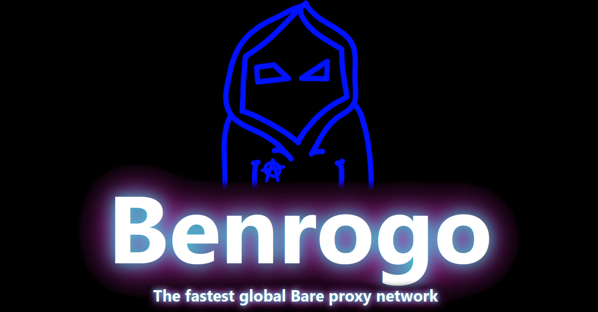

# Benrogo-Static
From the devs of Benrogo.net :)

## About
### [Benrogo](https://benrogo.net) has been serving proxy traffic to thousands of sites since 2022. The project initially had only one developer, but has since expanded. This repository allows you to host your own copy of Benrogo, and the goal of making this static and deployable is to further evade blocking and let the community suggest improvements or add new features.

## Platform Support
### Benrogo currently only supports deployment to Cloudflare Pages, but support for tons of common platforms is being worked on!

## How to host
### To host your own copy of Benrogo on Cloudflare Pages, fork this repository and set it up in your Cloudflare dashboard with [This guide](https://developers.cloudflare.com/pages/framework-guides/deploy-anything/#deploy-with-cloudflare-pages).

## Licensing
### This project is licensed under a MIT License. This means you are allowed to use it for personal and commercial (non patented) use, but you must include a copy of the license with any modified versions of Benrogo-Static.